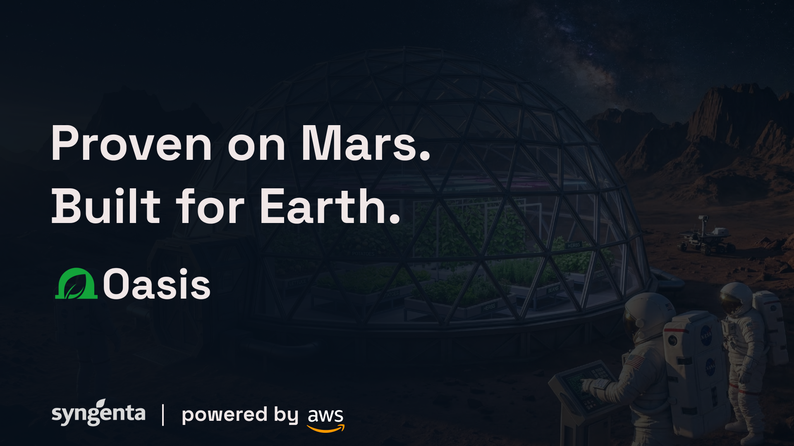
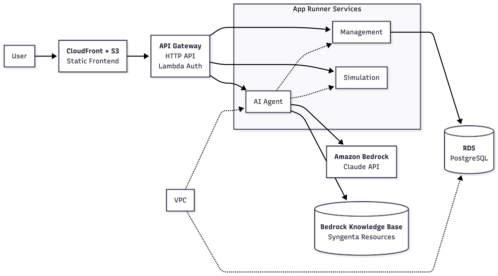

<p align="center">
  
</p>

<p align="center">
Oasis is an autonomous AI agent that doesn't just manage a greenhouse, it teaches itself how to farm. Grounded in Syngenta's Knowledge Base and forged under extreme conditions, built to transfer to precision agriculture on Earth.
</p>

<p align="center">
  <a href="https://d1jnha6e8xdf6p.cloudfront.net/simulation/">Try the live demo</a>
</p>

---

## What it does

Oasis runs a 450-day Martian greenhouse simulation to feed a crew of 4 astronauts. An AI agent plans crop allocations, reacts to crises in real time, and rewrites its own strategy after each run. Every decision is grounded in Syngenta's MCP Knowledge Base, covering crop profiles, stress management, and nutrition data.

The same technology transfers directly to controlled environment agriculture (CEA) on Earth: vertical farms, hydroponic systems, and Syngenta's Cropwise platform.

## Architecture

<p align="center">
  
</p>

## Tech stack

| Layer | Stack |
|-------|-------|
| Frontend | Next.js 16, React 19, Tailwind v4, shadcn/ui, Recharts, Framer Motion |
| Agent | Python 3.12, FastAPI, LangGraph, boto3 (AWS Bedrock) |
| Simulation | Python 3.12, FastAPI, Pydantic (stateless physics engine, 192 tests) |
| Backend | Java 21, Spring Boot 4.0, PostgreSQL 16 |
| Infra | Terraform, Docker, AWS (ECR, App Runner, RDS, API Gateway) |

## Getting started

### Local development

```bash
# Start Postgres, simulation, management backend, and agent
docker-compose up

# In a separate terminal, start the frontend
cd frontend
npm install
npm run dev
```

Services will be available at:
- Frontend: `http://localhost:3000`
- Agent: `http://localhost:8000`
- Simulation: `http://localhost:8001`
- Management Backend: `http://localhost:8080`

### AWS deployment

The `infra/fast/` directory contains a Terraform configuration for a full AWS deployment (App Runner, RDS, API Gateway). See [`infra/fast/README.md`](infra/fast/README.md) for the step-by-step guide.

```bash
cd infra/fast
terraform init
terraform apply
../../scripts/deploy-all.sh
```

## Simulation

The simulation models a 4x4 greenhouse grid (64 m2) on Mars with:

- **5 crops** from Syngenta's KB: lettuce, potato, radish, beans/peas, herbs
- **Seasonal Mars environment**: 9-15h solar hours, -83 to -43 C surface temperature
- **Resource management**: 40,000L water (90% recycling), 20,000 nutrient units (70% recycling)
- **7 stress types**: drought, overwatering, heat, cold, nutrient deficiency, light insufficiency, CO2 imbalance
- **2 crisis events**: water recycling degradation, temperature control failure
- **Crew feeding**: greenhouse-first with stored food fallback, tracking calories, protein, and 7 micronutrients

```bash
# Run the simulation test suite
cd simulation
pytest tests/ -v
```

Full specification: [`simulation/docs/SIMULATION-SPEC.md`](simulation/docs/SIMULATION-SPEC.md)

## The AI agent

The agent uses a LangGraph state machine with 5 nodes:

1. **Init**: load strategy document and fetch crop profiles from KB
2. **Plan**: LLM decides crop assignments, water, light, and temperature for the next 30 days
3. **Simulate**: execute the plan through the physics engine
4. **React**: if a crisis triggers (health < 30, water < 6000L, energy deficit 3+ days), query the KB live and adjust
5. **Reflect**: after 450 days, analyze the full run and rewrite the strategy document

Each run takes around 20-25 LLM calls. The agent improves with every simulation.

## Project structure

| Directory | Description |
|-----------|-------------|
| `frontend/` | Next.js dashboard |
| `backend/` | AI agent orchestrator (LangGraph + Bedrock) |
| `simulation/` | Stateless physics engine (FastAPI) |
| `management-backend/` | Data persistence layer (Spring Boot) |
| `infra/` | Terraform (fast-track and production) |
| `scripts/` | Deployment scripts |
| `product/` | Product documentation, brand, pitch, research |
| `integration-tests/` | End-to-end test suites |

## Mars-to-Earth transfer

The controlled environment agriculture market is projected to grow from $108B to $420B by 2035. NASA's Biomass Production Chamber (1988-2000) pioneered the LED lighting, hydroponics, and closed-loop systems now used by companies like Plenty, AeroFarms, and Bowery Farming.

Oasis applies the same principles with an autonomous decision layer on top. The agent architecture maps directly to Syngenta's Cropwise platform as a decision-support module for real-world greenhouse and vertical farm operations.
